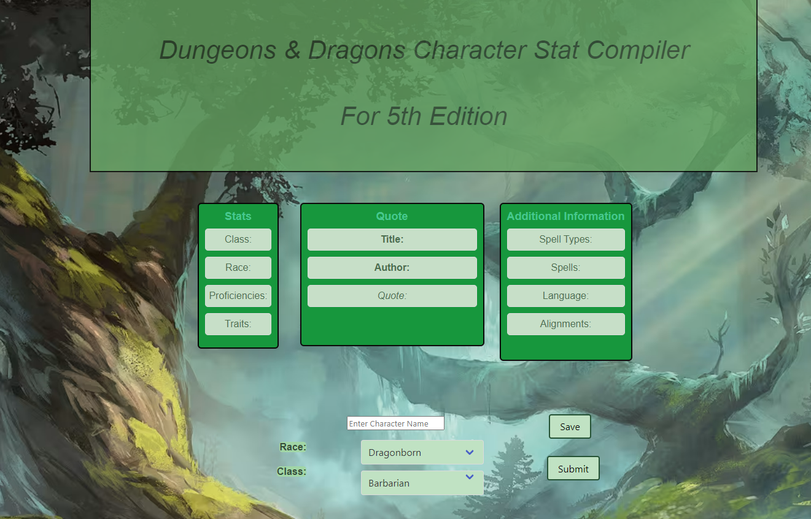

# Dungeons & Dragons Character Stat Compiler

This project is a Dungeons & Dragons (D&D) Character Stat Compiler that allows users to select a class, race, and displays relevant information about the chosen character. It also includes a feature to generate a random poem for added flair.

## Features

- Select a D&D class and race from dropdown menus.
- Display relevant information such as class details, race traits, and a randomly generated poem.
- Save the displayed information to local storage for future reference.
- Navigate between the character creation and saved character pages.

## Getting Started

    git clone https://github.com/CRNaro/group-project-01.git

- **Open the project in your preferred code editor.
- **Open the index.html file in a web browser to interact with the character stat compiler.

## Usage
1. Open index.html in a web browser.
2. Select a race and class from the dropdown menus.
3. Click the "Submit" button to fetch and display character information.
4. Optionally, click the "Save" button to save the displayed information.
5. Navigate to local.html to view the saved character information.

## Dependencies
- **Bulma: A modern CSS framework.

## API Used

- **D&D 5th Edition API:** [D&D 5e API](https://www.dnd5eapi.co/docs/#overview)

- **PoetryDB API:** [PoetryDB](https://github.com/thundercomb/poetrydb/tree/master)

## Contributing
Contributions are welcome! If you find any issues or have suggestions for improvements, please open an issue or create a pull request.

## License
This project has no licenses.
